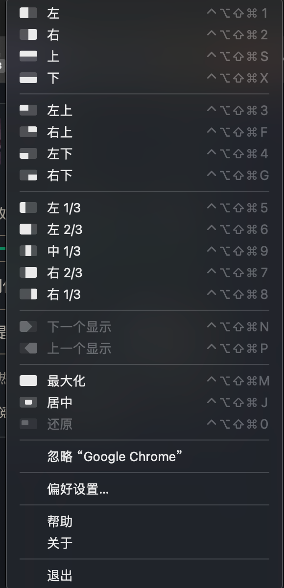
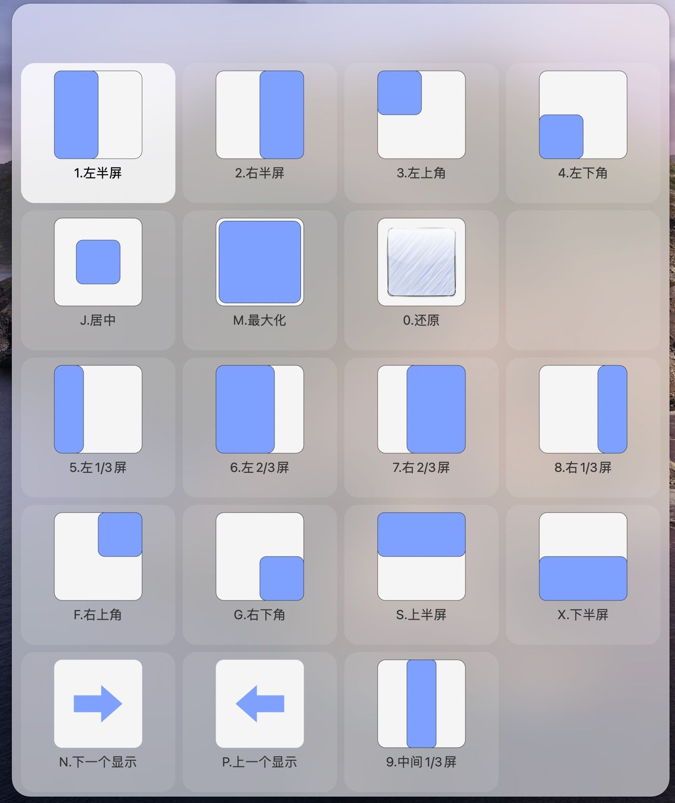
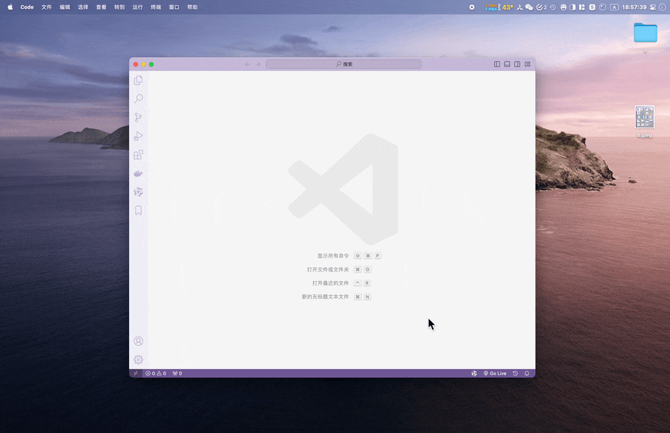
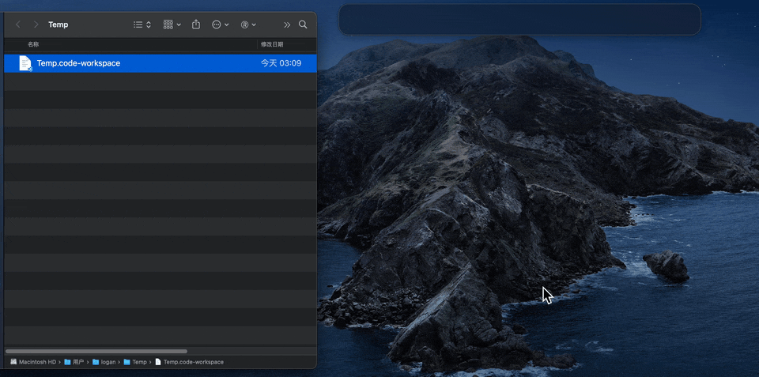

# 自己做的一些在用的 alfred 的workflow

> 若不放心， 可以把后缀名修改为zip打开后查看源码

## 使用 alfred 调用 magnet 进行分屏

* 前提,要设置magnet的快捷键如下图所示, 或者自己修改 json 数据

* 效果：

## 新建文件

> alfred
> > 输入 new，回车 : 在默认目录新建
>
> > 输入 new，command+回车 : 选择目录新建

> > 输入 文件名，回车 : 新建文件保留空格; 重复文件名末尾会加数字(扩展名之前)
>
> > 输入 文件名，command+回车 : 新建多个文件, 以空格为分隔符; 重复文件名末尾会加数字(扩展名之前)

## 划词搜索

## 直接复制文件内容

